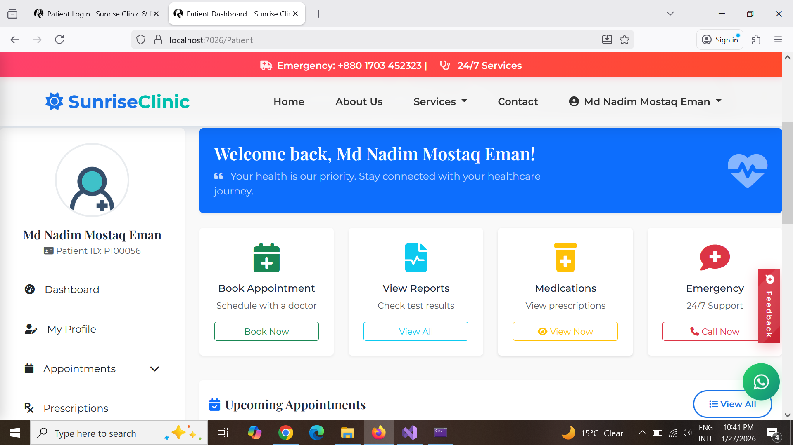

# 🏥 Sunrise Clinic & Diagnostic Center
**Professional Hospital & Diagnostic Management System**  
Built with **ASP.NET Core MVC (.NET 8)**

---

## 📌 Overview
Sunrise Clinic & Diagnostic Center is a full-featured hospital and diagnostic management system
designed for real-world clinics and diagnostic centers.

The system provides secure role-based dashboards for:
- Admin
- Doctor
- Nurse
- Patient

---

## 🖼️ Application Preview

### Login Page

### Admin Dashboard

### Doctor Dashboard

### Nurse Dashboard

### Patient Dashboard

---

## ✨ Key Features
- Secure authentication & role-based authorization
- Appointment management system
- Diagnostic report & prescription upload
- Patient complaint management
- Public hospital website pages

---

## 🧰 Technology Stack
- ASP.NET Core MVC (.NET 8)
- Microsoft SQL Server
- Entity Framework Core
- Razor Views & Bootstrap

---

## 👨‍💻 Author
**MD Nadim Mostaq Eman**
